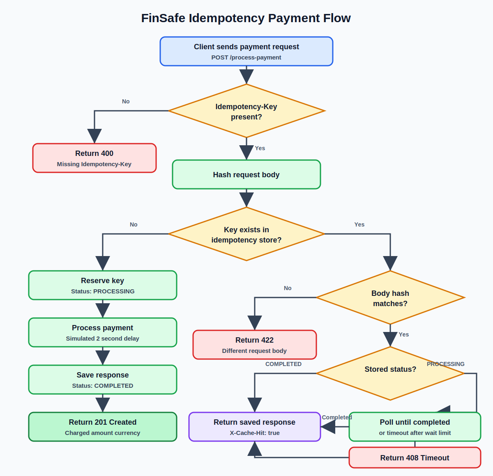

# Idempotency Gateway

REST API for FinSafe Transactions Ltd. that prevents duplicate payment charges when clients retry requests after timeouts.

## Architecture Flow



## Requirements

- Node.js 18+
- Optional: Redis running locally or a hosted Redis URL

This project uses Redis as the preferred idempotency store. If Redis is not
available, the API falls back to an in-memory store so reviewers can run the
server immediately after installing dependencies.

## Setup

```bash
npm install
```

Create `.env`:

```env
PORT=5000
REDIS_URL=redis://localhost:6379
```

For production-like behavior, start Redis locally on Windows by using WSL:

```bash
sudo apt update
sudo apt install redis-server
sudo service redis-server start
redis-cli ping
```

`redis-cli ping` should return `PONG`.

You can also use a hosted Redis provider and set `REDIS_URL` to that connection string.

## Run

```bash
npm start
```

If Redis is running, the API will use it. If Redis is unavailable, the API logs
that it is using the in-memory fallback and still starts successfully.

API docs are available at:

```text
http://localhost:5000/api-docs
```

## Endpoint

### Process Payment

```http
POST /process-payment
Idempotency-Key: unique-payment-key
Content-Type: application/json

{
  "amount": 100,
  "currency": "GHS"
}
```

First successful response:

```json
{
  "status": "success",
  "message": "Charged 100 GHS"
}
```

Duplicate request with the same key and same body returns the same status and body with:

```http
X-Cache-Hit: true
```

Duplicate request with the same key and a different body returns:

```json
{
  "message": "Idempotency key already used for a different request body."
}
```

Invalid payment bodies return:

```json
{
  "message": "Request body must include a positive numeric amount and a currency."
}
```

## Sample cURL Requests

First request:

```bash
curl -i -X POST http://localhost:5000/process-payment \
  -H "Content-Type: application/json" \
  -H "Idempotency-Key: order-123" \
  -d '{"amount":100,"currency":"GHS"}'
```

Duplicate request with the same key and same body:

```bash
curl -i -X POST http://localhost:5000/process-payment \
  -H "Content-Type: application/json" \
  -H "Idempotency-Key: order-123" \
  -d '{"amount":100,"currency":"GHS"}'
```

Same key with a different body:

```bash
curl -i -X POST http://localhost:5000/process-payment \
  -H "Content-Type: application/json" \
  -H "Idempotency-Key: order-123" \
  -d '{"amount":500,"currency":"GHS"}'
```

## Tests

```bash
npm test
```

The tests cover:

- Missing `Idempotency-Key`
- First payment request
- Duplicate replayed request
- Same key with different body
- Invalid payment body
- In-flight request polling
- Race-condition reservation using Redis `SET NX`
- Deterministic body hashing
